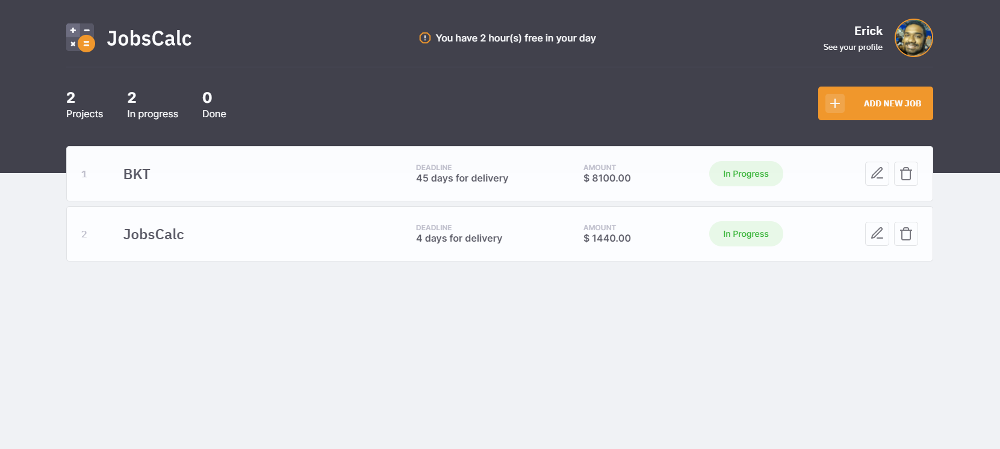
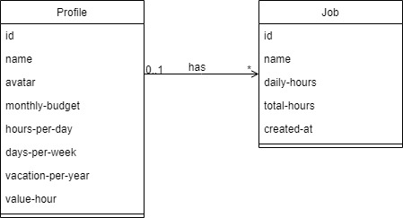

<h1 align="center">
  
</h1>

<p align="center">
  <a href="#technologies">Technologies</a>&nbsp;&nbsp;|&nbsp;&nbsp;
  <a href="#project">Project</a>&nbsp;&nbsp;|&nbsp;&nbsp;
  <a href="#diagram">Diagram</a>&nbsp;&nbsp;|&nbsp;&nbsp;
  <a href="#how-to-run">How to run</a>&nbsp;&nbsp;|&nbsp;&nbsp;
  <a href="#license">License</a>
</p>

<p align="center">
  
</p>

<br>

<p align="center">
  
</p>

## Technologies

This project was developed with the following technologies:

- HTML
- CSS
- JavaScript
- [Node.js](https://nodejs.org)
- [npm](https://www.npmjs.com/)
- [EJS](https://ejs.co/)
- [Express](https://expressjs.com/)
- [Nodemon](https://nodemon.io/)
- [SQLite](https://sqlite.org)

## Project

JobsCalc is a calculation estimation application for freelancer projects (jobs) where it's possible to add and delete jobs and obtain a cost estimate for each job. 

Also, it's possible to calculate the hourly value of the freelancer.

## Diagram

<p align="center">
  
</p>

## How to run

Prerequisites:

Download and install [Node.js](https://nodejs.org/en/download/) and [npm](https://www.npmjs.com/get-npm).

<br>

- Clone the repository
```bash
git clone https://github.com/erickmp07/jobs-calc.git
```
- Install the dependencies with [`npm install` command](https://docs.npmjs.com/cli/v7/commands/npm-install)
```bash
npm install
```
- To start the server
```bash
npm run dev
```

## License

Licensed under [MIT](LICENSE) license